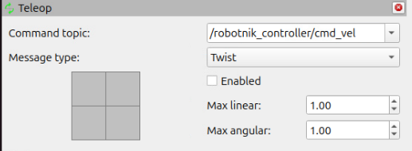
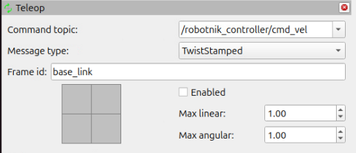

# teleop_panel

`teleop_panel` is a simple RViz panel plugin for manual robot teleoperation on ROS 2.

It provides:

- A 2D drive widget inside RViz
- An editable command topic field with live, filtered topic suggestions
- Command message type selection (`Twist` / `TwistStamped`)
- Enable/disable control of the publisher
- Linear and angular velocity scaling

The plugin is intended to replace the old teleoperation panel from `rviz_plugin_tutorials` with a package maintained in the Robotnik workspace.

## Build

Build the package in a ROS 2 workspace with:

```bash
colcon build --packages-select teleop_panel
```

## Use in RViz

Once the workspace is built and sourced, the panel can be added from RViz as:

`Panels` -> `Add New Panel` -> `teleop_panel/Teleop`

In Robotnik simulation, the provided RViz configurations already include this panel.

## Command topic

The **Command topic** field is an editable combo box:

- You can always type any topic name manually, even before the target node
  exists. The typed topic is used as-is for publishing.
- The drop-down lists topic suggestions discovered on the ROS 2 graph. A topic
  is suggested only when at least one node **subscribes** to it with the
  selected command message type (`geometry_msgs/msg/Twist` in `Twist` mode,
  `geometry_msgs/msg/TwistStamped` in `TwistStamped` mode), so the list focuses
  on command topics that something is actually consuming.
- Suggestions refresh automatically every few seconds and immediately when the
  message type changes. The refresh never overwrites or auto-selects your
  current topic — it only updates the drop-down.

Suggestions are a convenience only; they do not restrict what you can publish to.

## Message type

The panel exposes a **Message type** combo box with two options:

- **Twist** — publishes `geometry_msgs/msg/Twist`. This is the default, kept for
  backward compatibility with existing setups.
- **TwistStamped** — publishes `geometry_msgs/msg/TwistStamped`. Useful for newer
  `ros2_control` / `diff_drive_controller` / Nav2-style setups that expect a
  stamped command with a header.

When **TwistStamped** is selected, an extra **Frame id** row appears. Its
value (default `base_link`) is written to `header.frame_id`, and `header.stamp`
is filled with the current ROS time. The frame id row is hidden and the frame id
is unused while **Twist** is selected.

The two screenshots below show the panel in each mode — note how the **Frame id**
row only appears in `TwistStamped` mode:

| `Twist` mode | `TwistStamped` mode |
|:---:|:---:|
|  |  |

The selected message type and frame id are saved and restored with the RViz
configuration. Older config files without these fields load as `Twist` /
`base_link`.

## Notes

- The panel publishes `geometry_msgs/msg/Twist` or `geometry_msgs/msg/TwistStamped`
  depending on the selected command message type
- The topic must match the robot command topic used in the current simulation or deployment
- If multiple teleoperation sources publish to the same topic at the same time, they can interfere with each other
